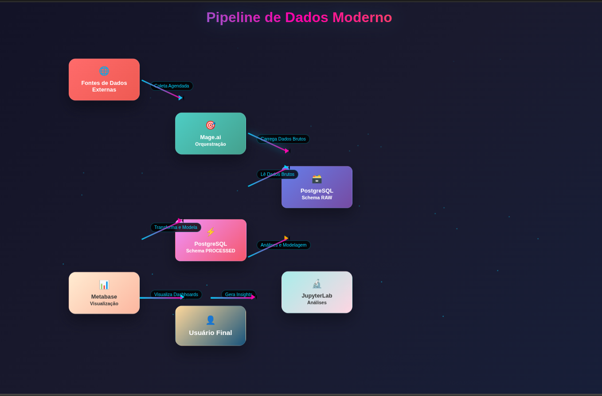
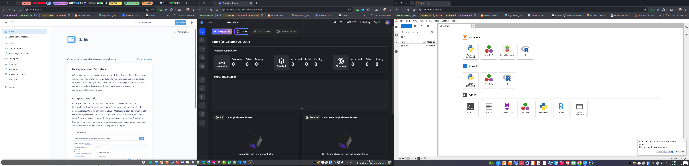
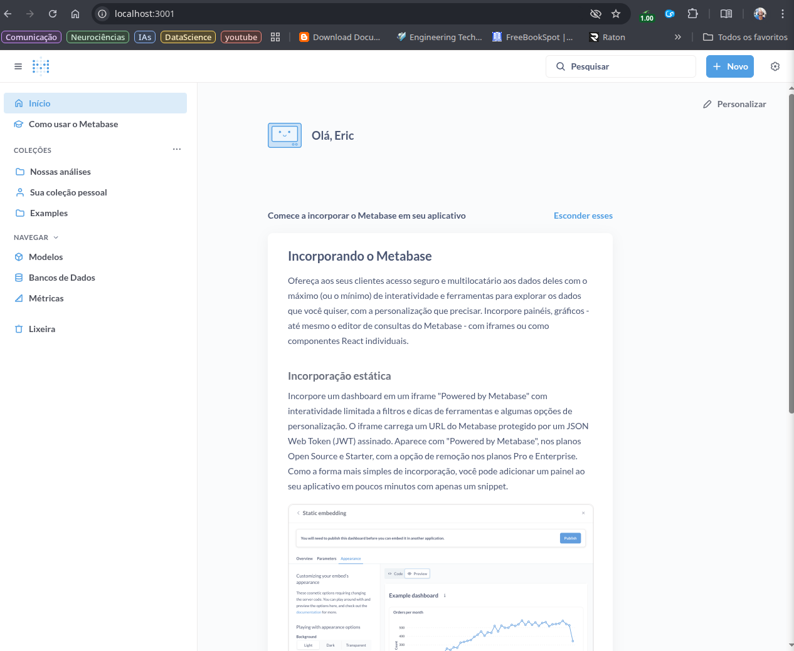
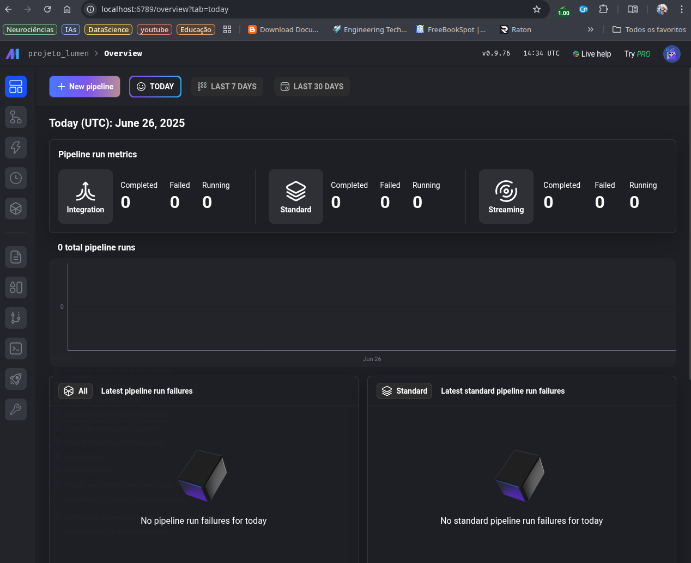
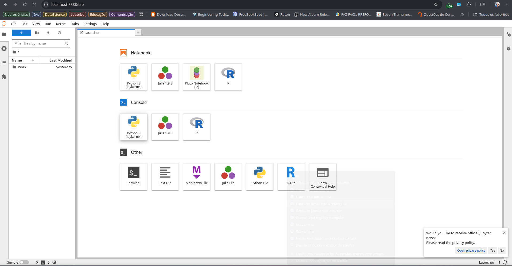

# 🌌 Projeto LÚMEN: Laboratório Unificado de Modelagem, Engenharia e Narrativas


> "Onde há dados, há padrão. Onde há padrão, há informação. Onde há informação, há narrativa. E onde há narrativa, há o poder de transformar a realidade. LÚMEN é a nossa forja de narrativas."

## 🚀 Bem-vindo à Forja de Narrativas de Dados!

Este é o repositório do **Projeto LÚMEN**, um ecossistema de dados ponta-a-ponta, totalmente open-source e containerizado, projetado para ser uma plataforma robusta, escalável e reprodutível para análise, engenharia de dados e experimentação com Machine Learning.

Ele nasce da filosofia de que ferramentas de nível profissional não devem ser um privilégio corporativo, mas um poder acessível a todos os estudiosos, curiosos e criadores na galáxia dos dados.

## 🎯 Propósito do Ecossistema

O objetivo principal do LÚMEN é:

*   **Plataforma de Portfólio:** Servir como um projeto de portfólio robusto, demonstrando competências em uma stack de dados moderna e completa.
*   **Laboratório de Estudos:** Oferecer um ambiente completo e isolado para estudos, testes e desenvolvimento de projetos de dados, do ETL à visualização.
*   **Demonstração de Arquitetura:** Apresentar uma arquitetura de dados coesa e desacoplada, simulando um ambiente corporativo real.
*   **Reprodutibilidade:** Garantir que qualquer pessoa possa replicar o ambiente com poucos comandos, facilitando a colaboração e o aprendizado.

## 🛠️ A Constelação de Tecnologias

O LÚMEN integra um conjunto de ferramentas poderosas, cada uma com um papel fundamental em nossa jornada dos dados:

*   **Orquestração e Containerização:**
    *   **Docker & Docker Compose:** O motor que dá vida ao nosso ecossistema, garantindo que todos os serviços rodem de forma isolada e consistente em qualquer máquina.

*   **Os Pilares da Arquitetura:**
    *   **PostgreSQL (O Templo do Saber):** Nosso banco de dados relacional, o guardião seguro e confiável de todo o conhecimento bruto e processado.
    *   **Mage.ai (A Forja do Alquimista):** A ferramenta moderna de ETL/ELT, onde orquestramos os fluxos de dados, da extração à transformação.
    *   **Metabase (O Observatório Cósmico):** Nossa plataforma de Business Intelligence, a janela para a alma dos dados, onde as narrativas ganham vida em dashboards e gráficos.
    *   **JupyterLab (O Laboratório do Cientista):** O ambiente interativo para exploração de dados, análises ad-hoc e desenvolvimento de modelos de Machine Learning.

### 📜 O Grimório de Automação (Makefile)

Para navegar pelas correntes cósmicas do Docker, um Mestre não digita longos e repetitivos encantamentos. Em vez disso, ele usa um grimório de automação: o `Makefile`.

Este artefato ancestral, presente em quase todos os grandes projetos de software, nos permite criar atalhos (ou *feitiços*) para os comandos mais complexos. No Projeto LÚMEN, ele é a sua varinha mágica para orquestrar todo o ecossistema com simplicidade e elegância. Em vez de memorizar os detalhes do `docker-compose`, você apenas invoca o feitiço desejado.

Aqui estão os feitiços que preparei para você neste grimório:

| Feitiço (`make ...`) | Encantamento Real (`docker-compose ...`) | Descrição Mística                                                              |
| :------------------- | :--------------------------------------- | :----------------------------------------------------------------------------- |
| `make up`            | `docker-compose up -d`                   | Invoca e ergue toda a constelação de serviços LÚMEN em segundo plano.          |
| `make down`          | `docker-compose down`                    | Dispensa graciosamente os serviços, colocando-os para repousar em sua dimensão. |
| `make build`         | `docker-compose build`                   | Reforja as imagens dos seus contêineres após alterações em seus Dockerfiles.    |
| `make logs`          | `docker-compose logs -f`                 | Abre um portal para observar os sussurros e eventos de todos os serviços.      |

Com este conhecimento, você detém o poder de controlar seu laboratório com a agilidade de um verdadeiro Guardião do Conhecimento.

## ⚙️ Arquitetura e Fluxo de Dados

A arquitetura foi projetada para ser modular e escalável. O fluxo de dados lógico segue as melhores práticas de engenharia de dados:



## 🏁 Como Iniciar a Jornada (Guia de Instalação)

Para explorar a constelação LÚMEN em sua própria máquina, siga estes passos:

1.  **Clone o Repositório:**
    ```bash
    git clone https://github.com/enps2015/projetoLUMEN.git
    cd projetoLUMEN
    ```

2.  **Configure o Ambiente:**
    Crie um arquivo `.env` na raiz do projeto, copiando o exemplo `.env.example`. Este arquivo contém as credenciais para o banco de dados.
    ```bash
    cp .env.example .env
    ```
    *Sinta-se à vontade para alterar as credenciais no arquivo `.env` se desejar.*

3.  **Inicie o Ecossistema:**
    Use nosso `Makefile` para subir todos os serviços de forma simples e rápida.
    ```bash
    make up
    ```
    *Como alternativa, você pode usar o comando `docker-compose up -d`.*

4.  **Acesse os Serviços:**
    Após a inicialização, os serviços estarão disponíveis nos seguintes portais:
    *   **Metabase:** `http://localhost:3001`
    *   **Mage.ai:** `http://localhost:6789`
    *   **JupyterLab:** `http://localhost:8888`
    *   **PostgreSQL:** Conecte-se via `localhost` na porta `5432` com seu cliente SQL favorito.

5.  **Desligue o Ecossistema:**
    Para parar todos os contêineres, use:
    ```bash
    make down
    ```

## 🖼️ Visão Geral do Ecossistema em Ação


**Visão geral do Ecossistema funcionando:**

`

**Dashboard no Metabase:**

`

**Pipeline no Mage.ai:**

`

**Análise no JupyterLab:**

`

## 🔭 Próximos Passos na Jornada

O ecossistema LÚMEN está com sua infraestrutura base pronta. Os próximos passos na nossa jornada são:

*   [ ] **Desenvolver o Pipeline de Ingestão:** Criar o primeiro pipeline no Mage.ai para extrair dados de uma fonte externa (como a API do INMET).
*   [ ] **Criar Scripts de Transformação:** Desenvolver e orquestrar os scripts de limpeza e modelagem dos dados brutos.
*   [ ] **Construir Dashboards Analíticos:** Criar as primeiras visualizações e dashboards no Metabase para contar a história dos dados.
*   [ ] **Realizar Análises Exploratórias:** Utilizar o JupyterLab para explorar os dados processados e buscar insights mais profundos.
*   [ ] **Integrar MLflow:** Adicionar o serviço MLflow para rastreamento e gerenciamento do ciclo de vida de modelos de Machine Learning.

## 🤝 Como Contribuir

Este é um projeto vivo e aberto a contribuições. Se você tem ideias para melhorias, novos pipelines, ou quer ajudar a expandir o ecossistema, sinta-se à vontade para abrir uma *Issue* ou um *Pull Request*.

## 👨‍💻 Contato e Conexões

**Desenvolvido com paixão e a Força dos Dados por:**

**Eric Pimentel**

[](https://www.linkedin.com/in/eric-np-santos/)
[](https://github.com/enps2015)
[](https://www.instagram.com/eric.n.pimentel/)
[](mailto:enps2006@gmail.com)

---

*✨ Última atualização: 24 de Junho de 2025 ✨*